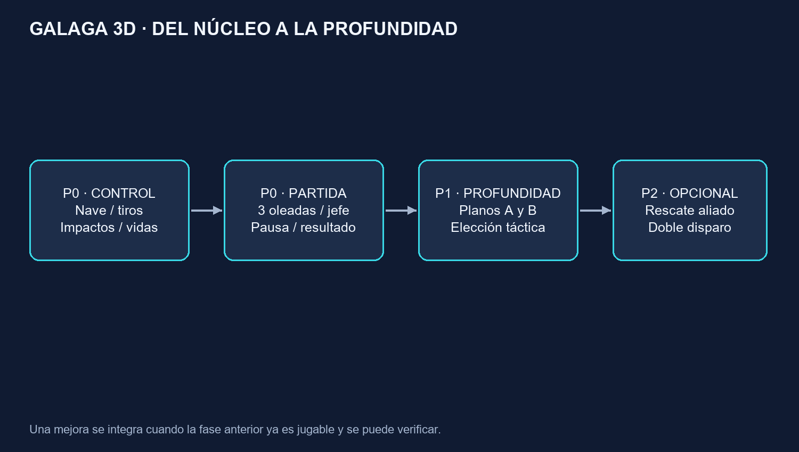
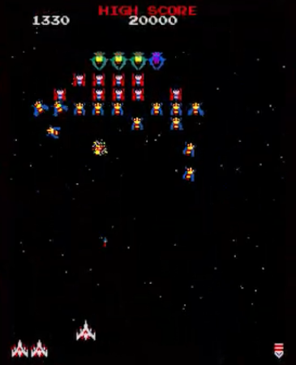
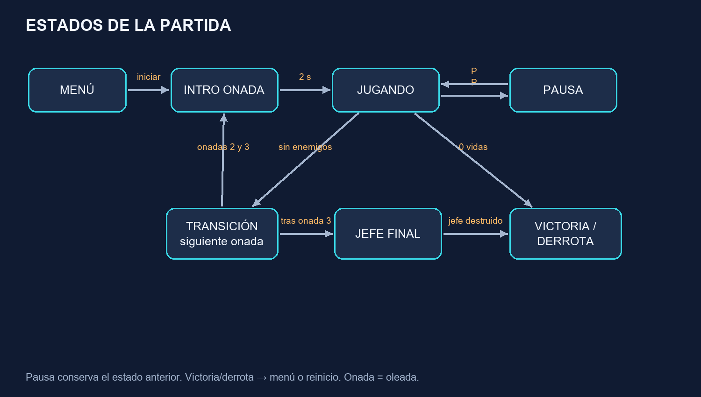
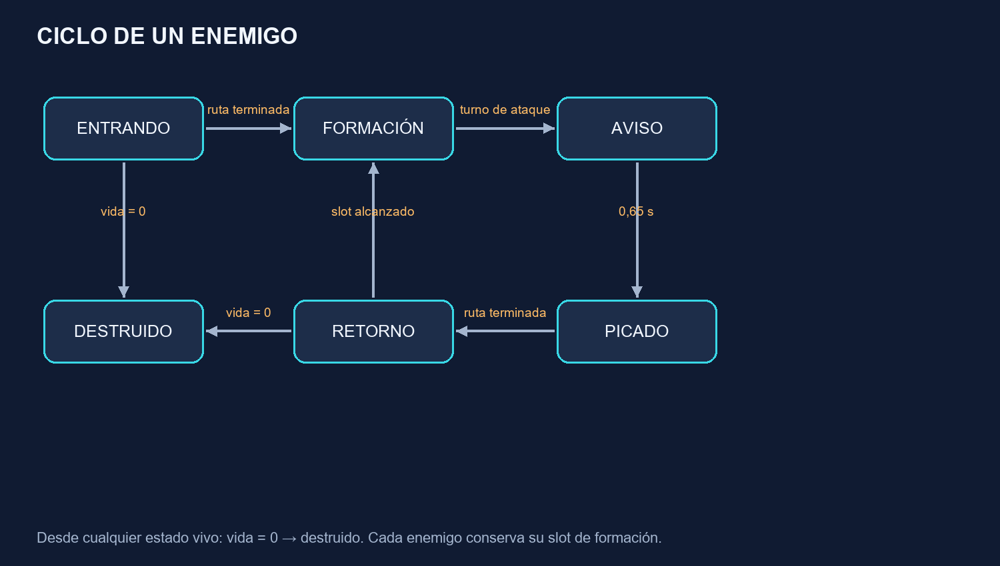
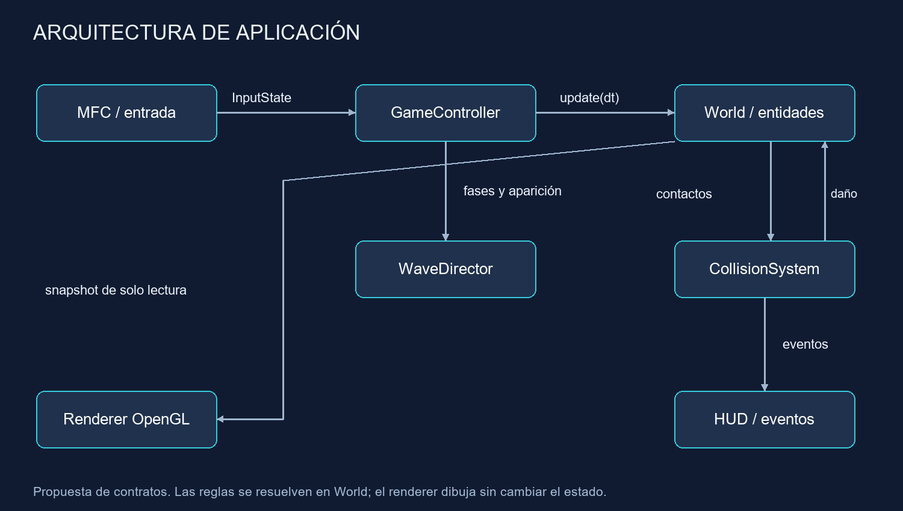

# GALAGA 3D · Diseño de Amin

Propuesta preparada el 7 de octubre de 2026.


## GALAGA 3D · Diseño de Amin

Amin El Alam Tizniti · Grupo 3 · Arcade 3D / Galaga · VGI, EE-UAB · Curso 2026-27


Trabajo iniciado el 7 de octubre de 2026 para la reunión del 8 de octubre, interpretando “mañana” en tu mensaje inicial. El acta deja pendiente la fecha de la reunión: esta fecha de trabajo no sustituye una convocatoria oficial.


### Qué llevas preparado


Un diseño de aplicación que convierte la idea del acta en reglas, estados, entidades, oleadas y colisiones concretas. Incluye una propuesta de profundidad, un plan de integración, criterios de aceptación y materiales para explicarlo al grupo.


### Cómo usarlo


Primero lee las páginas 2, 4, 6, 9, 13 y 24. Abre INICIO.html para mostrar la maqueta y las figuras. Usa las páginas restantes como consulta técnica y como base de documentación.


Estado real: diseño elaborado y maqueta didáctica disponible. El juego C++/MFC/OpenGL del grupo sigue pendiente de implementación e integración. Ninguna propuesta de este dossier se presenta como un acuerdo ya aprobado.


La maqueta del navegador sirve para demostrar reglas y decisiones. No reproduce todos los valores de balance ni valida el objetivo de una partida de 5 a 8 minutos.





## 01 · Lectura exacta del acta

Qué te has comprometido a aportar y qué significa cada porcentaje.


| Área | Tu participación prevista | Material preparado |
| --- | --- | --- |
| Diseño de aplicación | Responsable; 40 %; estimación: 2 semanas | Reglas, entidades, estados, oleadas, colisiones y profundidad. |
| Estado del arte | 20 %; responsable: Pablo | Síntesis de mecánicas y referencias para trabajar con Pablo. |
| Implementación | 20 %; responsable: Iker | Contratos entre módulos, orden de integración y pseudocódigo. |
| Interfaz | 10 %; responsable: Ferran | Requisitos del HUD, cámara y comunicación de estados. |
| Test | 10 %; responsable: Uri | Casos verificables y condiciones límite. |
| Memoria / presentación | 10 %; responsable: David | Guion, decisiones documentadas, fuentes y entregables. |


### La tarea inmediata


En las páginas 1 y 2 se pide a Pablo y Amin estudiar las mecánicas de Galaga y definir las reglas, los estados de los enemigos y la estructura del juego para la próxima reunión. Ese es el núcleo de esta entrega.


### Límites de la evidencia


Los porcentajes del acta expresan participación prevista dentro de cada área; no son porcentajes del proyecto completado. El acta registra 0 % de desarrollo. Las estimaciones de 2, 4 o 6 semanas pueden solaparse y no establecen fechas de entrega.


El acta anuncia objetivos verificables y fases en un anexo, pero el PDF facilitado contiene 3 páginas y no incluye dicho anexo. Los criterios de este dossier son propuestas nuevas. Tampoco se han facilitado rúbrica, plantilla C++ ni repositorio.


## 02 · Referente: qué conservar de Galaga

Resumen del juego original apoyado en la documentación del editor.


Galaga, publicado en 1981, permite mover la nave lateralmente y disparar. Los enemigos entran, forman y atacan. La ficha oficial distingue tres tipos y describe unas 40 unidades por fase y un máximo de dos disparos del jugador en pantalla. Un enemigo puede capturar la nave; rescatarla permite combinar dos naves y ganar potencia a cambio de mayor tamaño. [F1]


### Traducción al proyecto


Conservar la lectura rápida del campo, las entradas coreografiadas y el contraste entre formación estable y ataque móvil. Diseñar una nave que responda inmediatamente. Dar al jugador una razón para apuntar a un enemigo que se separa del grupo.


### Decisiones propias


Tres oleadas y un jefe final proceden de la propuesta del acta. Las cantidades de enemigos, puntos y tiempos que aparecen después son valores iniciales propios. La introducción de planos de combate es la innovación del grupo, no una mecánica atribuida al original.


Imagen: captura del tráiler oficial de Namco Museum, de Bandai Namco Entertainment America, obtenida de Wikimedia Commons [F8]; CC BY 3.0 según su ficha. Archivo descargado sin modificar. Se usa para observar distribución y siluetas; no es un recurso del juego 3D ni un modelo de nuestra autoría.





## 03 · Comparación y criterio de adaptación

Aportación al estado del arte que puedes revisar con Pablo.


| Referencia | Dato documentado | Decisión de diseño |
| --- | --- | --- |
| Galaga [F1] | Control lateral, formación y captura/rescate. | Priorizar claridad y alternancia entre apuntar y esquivar. |
| Galaga ’88 [F2] | Amplía la combinación hasta triple nave e introduce rutas por dimensiones. | La profundidad debe ofrecer una elección entendible; limitarla a dos planos. |
| Entrevista a Yokoyama [F3] | Relata la incorporación de captura y doble nave durante el prototipado. | Evaluar una mejora con una base jugable antes de ampliar alcance. |
| Galaga Legions DX, vídeo oficial [V1] | Recurso audiovisual de otra adaptación de la serie. | Usarlo para debatir densidad visual; no copiar su alcance. |


### Tres alternativas


A: escena 3D con juego en un plano. Coste bajo, muy legible y adecuado como primera versión. B: dos planos discretos. Coste medio y elección táctica clara; es la mejora elegida en el acta. C: vuelo libre en 3D. Coste alto: añade orientación, cámara y puntería espacial; no encaja bien en el alcance inicial.


### Recomendación razonada


Construir A y pasar a B cuando las colisiones y el ciclo completo funcionen. Representar con modelos volumétricos, iluminación y materiales desde A. El escenario puede ser 3D aunque el control esté restringido a un plano.


Criterio de selección: una persona nueva debe poder explicar por qué un disparo ha impactado o ha pasado de largo. La innovación se valora por la decisión que aporta, no por la cantidad de ejes de movimiento.


## 04 · Visión y alcance del juego

Una partida corta que mantiene el ritmo arcade y añade profundidad controlada.


### Descripción que puedes presentar


Galaga 3D es un arcade de supervivencia y puntería: el jugador controla lateralmente una nave, rompe formaciones enemigas y esquiva picados. Debe superar tres oleadas y derrotar un jefe. Una segunda fase introduce dos planos para elegir dónde atacar y dónde esquivar.


| Prioridad | Contenido | Criterio para darlo por listo |
| --- | --- | --- |
| P0 · base | Movimiento, disparo, impactos, vidas, puntuación, oleadas, jefe, pausa y reinicio. | Una partida puede terminar en victoria o derrota sin errores de estado. |
| P1 · profundidad | Cambio A/B, filtros de impacto y avisos de plano. | Los casos de impacto entre planos pasan y el HUD es legible. |
| P2 · opcional | Rescate de nave aliada y doble disparo. | Solo se integra si P0 y P1 están estables. |


### Objetivo de experiencia


Duración deseada: 5 a 8 minutos, establecida en el acta. Se busca una primera oleada de aprendizaje, una segunda de presión moderada, una tercera que combine patrones y un jefe que compruebe lo aprendido.


### Qué implica terminar


Hay una pantalla inicial, reglas de entrada claras, una partida completa, resultado y posibilidad de reiniciar. La escena se renderiza en 3D y puede mostrar materiales y shaders compatibles con la plantilla docente.


El alcance de P0 incluye el jefe. “Prototipo mínimo” en las primeras tareas significa una entrega parcial de integración, no la versión final exigida por el proyecto.


## 05 · Reglas y controles

Propuesta de comportamiento: concreta, consistente y fácil de probar.


| Acción / condición | Regla propuesta |
| --- | --- |
| Mover | A/D o flechas. Si se pulsan ambas direcciones, movimiento neto 0. |
| Disparar | Espacio mantenido: un disparo cada 0,22 s; máximo 4 proyectiles aliados activos. |
| Pausar | P: entrar/salir de pausa. Al perder foco: pausa automática. |
| Cambiar plano | E: solo P1; transición de 0,25 s y recarga de 1,2 s desde su final. |
| Vidas | 3 al empezar; un impacto válido resta 1. Sin vidas extra en P0. |
| Reaparición | 0,75 s de espera y 1,5 s de invulnerabilidad; reaparece centrado. |
| Victoria | Jefe con vida 0, si el jugador conserva al menos 1 vida al cerrar ese paso. |
| Derrota | Vidas = 0; tiene prioridad si también muere el jefe en el mismo paso. |
| Reiniciar | Botón de resultado o R en resultado. R durante juego exige confirmar en menú. |


### Reglas que evitan ambigüedad


Un proyectil aliado causa un punto de daño y se consume con el primer objetivo alcanzado. Los enemigos no se dañan entre sí. Los proyectiles enemigos no destruyen otros proyectiles. No hay daño por rozar el borde del campo.


Todos los números son ajustes propios iniciales. El límite de cuatro balas facilita el ritmo de la adaptación y difiere del original [F1]; no debe explicarse como una reproducción exacta.


La pausa congela simulación, recargas y trayectorias. Al reanudar se descarta el tiempo real transcurrido en pausa y se exige soltar las teclas de acciones para evitar un disparo o cambio involuntario.


## 06 · Máquina de estados de partida

Cada estado define qué se actualiza y qué entradas son válidas.


| Estado | Responsabilidad y salida |
| --- | --- |
| Menú | Permite iniciar. Crea una sesión limpia con semilla definida. |
| Intro oleada | Muestra número durante 2 s. No hay daño ni disparos; después entran enemigos. |
| Jugando | Actualiza nave, enemigos, proyectiles e impactos. |
| Pausa | Congela World y conserva el estado previo, también si era intro o transición. |
| Transición | Limpia proyectiles y efectos dañinos; espera 2 s y prepara siguiente fase. |
| Jefe final | Misma lógica de combate, con patrón y vida del jefe. |
| Victoria / derrota | Detiene el combate y presenta resumen. Permite reiniciar o volver. |


La oleada se completa cuando se ha terminado el programa de aparición y no quedan enemigos vivos, incluidos los que están en entrada, picado o retorno. Un enemigo fuera del encuadre durante una ruta no se considera muerto.





## 07 · Entidades y datos del mundo

Separar datos de juego y recursos gráficos evita que un cambio visual altere las reglas.


| Entidad | Datos mínimos | Función |
| --- | --- | --- |
| Player | id, position, previousPosition, radius, lives, plane, timers, state | Entrada, movimiento, disparo, daño y cambio de plano. |
| Enemy | id, type, hp, plane, state, slotId, route, routeTime, timers | Formación y ciclo de ataque. |
| Projectile | id, ownerTeam, plane, position, previousPosition, velocity, radius, damage, ttl | Desplazamiento, impacto y eliminación. |
| Boss | id, hp, state, phase, plane, timers | Patrones de combate finales. |
| WaveDefinition | spawnEvents, slots, attackInterval, maxDivers, seed | Configuración de una oleada. |
| GameSession | state, previousState, score, waveIndex, elapsedActive, statistics | Progreso y resultados. |
| VisualEffect | position, duration, kind | Explosión o aviso sin colisiones. |


### Invariantes


Cada entidad tiene un identificador estable. Una entidad marcada para eliminar no puede volver a causar daño o puntuar. La vida no baja de cero. El contador de enemigos se obtiene del estado real del mundo, no solo del tamaño de un vector.


### Separación de responsabilidad


Mesh y material son identificadores visuales. Las colisiones usan radios del diseño. El tamaño de una explosión no cambia la caja de impacto. El HUD consulta GameSession y no decide si el jugador ha perdido.


Usar enum class para estados, equipo y plano. Evitar cadenas de texto como estados lógicos y punteros a elementos de un vector que puede cambiar de tamaño.


## 08 · Tipos de enemigo y puntuación

Tres papeles simples antes de añadir comportamientos especiales.


| Tipo propuesto | Vida | Formación / picado | Papel |
| --- | --- | --- | --- |
| Explorador | 1 | 100 / 150 puntos | Silencio visual y ataques sencillos para aprender. |
| Interceptor | 1 | 150 / 225 puntos | Ruta lateral pronunciada y ataque más veloz. |
| Guardián | 2 | 250 / 375 puntos | Resiste un disparo; avisa del daño con cambio de material. |
| Jefe final | 24 | 2.000 al destruirlo | Combina patrones; no ocupa un slot normal. |


### Cuándo aplicar el bonus


El multiplicador 1,5 se aplica si el enemigo está en estado Picado en el paso del impacto letal. Aviso y Retorno cuentan como formación. Un enemigo otorga puntos una sola vez, al morir. El primer impacto al guardián no puntúa.


### Indicadores de respuesta


Un impacto válido muestra un destello breve. Una muerte produce explosión, suma visible y evento de sonido si se integra audio. Al jugador no se le obliga a distinguir la vida solo por un color: el guardián cambia también una pieza o una marca.


### Estadísticas útiles


Registrar disparos emitidos, impactos válidos y enemigos destruidos. Precisión = impactos / disparos, con resultado 0 si no se disparó. P0 no tiene penetración, por lo que un proyectil no puede producir dos impactos.


Los nombres, puntos, vida del jefe y multiplicador de esta tabla son decisiones para nuestra adaptación. No son una tabla histórica de Galaga.


## 09 · Máquina de estados de enemigos

Un enemigo vivo puede entrar, ocupar su formación, atacar y volver.


| Estado | Entrada / comportamiento / salida |
| --- | --- |
| Entrando | Recibe slot y ruta. Sigue la entrada; al completarla pasa a Formación. |
| Formación | Oscila con el grupo. Espera selección del director de ataques. |
| Aviso | Marca silueta y ruta inicial durante 0,65 s. No dispara todavía. |
| Picado | Sigue una ruta cuya meta lateral se fijó al empezar. Puede disparar una vez. |
| Retorno | Vuelve por el exterior; interpola hasta su slot reservado. |
| Destruido | Emite evento único de muerte, pierde colisión y se elimina al finalizar el paso. |


No perseguir cada fotograma al jugador. Guardar targetX al terminar Aviso permite anticipar el ataque. Si recibe daño durante cualquier estado vivo, resta hp; con hp = 0 cancela su ruta y su ataque.





## 10 · Formación, entradas y picados

Las trayectorias deben poder explicarse con pocos datos.


### Formación


Campo: x de -8 a 8, y de -5 a 7. Jugador: y = -4. Slot por fila/columna, numeradas desde 0: x = (columna - (columnas-1)/2) × 1,6; y = 6,0 - fila × 1,25. Hasta cinco filas quedan entre y=6 e y=1. La formación oscila en x con amplitud 0,45 y periodo 4 s. Los slots destruidos quedan vacíos.


### Entrada y retorno


Asignar una ruta por cada lado y escalonar salidas cada 0,25 s. Ajustar el extremo de entrada al slot cuando termina la ruta. En retorno, tomar el slot actual de la formación en movimiento como destino y cerrar con una interpolación suave de 0,35 s.


### Picado reproducible


Una curva Bézier cúbica usa cuatro puntos: P0 inicio, P1 salida lateral, P2 aproximación y P3 salida inferior. B(u) = (1-u)³P0 + 3(1-u)²uP1 + 3(1-u)u²P2 + u³P3. Con u = clamp(t/T,0,1), el tiempo T define su duración. Velocidad visual no uniforme es aceptable inicialmente; si distrae, remuestrear por longitud de arco.


### Ejemplo de ruta


Para un enemigo en (2,5): P0=(2,5), P1=(5,4), P2=(targetX,-2), P3=(targetX,-6). T=2,5 s. Al llegar a P3 sigue una ruta exterior hasta (6,7) y retorna al slot. Es un patrón propio, no una transcripción del arcade.


Todos los puntos se definen en unidades del mundo. La orientación del modelo sigue la tangente de la ruta; la colisión sigue su posición y radio. No recalcular toda la curva a partir de coordenadas de pantalla.


## 11 · Oleadas y dificultad progresiva

Propuesta de contenido inicial, con objetivos de aprendizaje distintos.


| Fase | Composición | Ataques iniciales | Tiempo objetivo |
| --- | --- | --- | --- |
| Oleada 1 | 12 exploradores + 6 interceptores | 1 picado simultáneo; cada 2,4 s | 70-100 s |
| Oleada 2 | 12 exploradores + 8 interceptores + 4 guardianes | 2 picados; cada 1,8 s | 80-110 s |
| Oleada 3 | 12 exploradores + 12 interceptores + 6 guardianes | 3 picados; cada 1,4 s | 90-120 s |
| Jefe | 1 jefe de 24 hp | Patrón cíclico con hueco seguro | 55-90 s |


### Entrada escalonada


Con 18, 24 y 30 enemigos, cada formación usa 6 columnas y 3, 4 o 5 filas. Las salidas cada 0,25 s duran 4,25, 5,75 y 7,25 s, más el recorrido de la última nave. El reloj de ataques empieza al completar la entrada inicial para facilitar el aprendizaje.


### Cómo se alcanza el objetivo temporal


Los intervalos dan una suma objetivo de combate de 295 a 420 s. Con introducciones, cambios de fase y pausas de reaparición, la previsión es aproximadamente 5 a 8 minutos activos. No hay evidencia de que los parámetros lo consigan aún: un jugador con buena puntería podría acabar mucho antes.


### Cómo ajustar


Medir seis partidas completas: tres personas con distinta experiencia juegan dos cada una. Registrar tiempos activos, muertes y mediana por persona. Si queda fuera de 300–480 s, documentar el ajuste o una desviación acordada. Excluir pausas y conservar build y evidencias.


P1 reparte enemigos entre planos A/B, con diferencia máxima de una unidad por tipo. P0 coloca todos en A. Una partida no tiene límite de tiempo duro en este diseño.


## 12 · Jefe final

Un patrón reconocible permite dificultad sin exigir reflejos imposibles.


### Estados y ciclo


Entrada 2 s, Aviso 0,8 s, Ráfaga 1,8 s, Recuperación 1,6 s. Repite Aviso → Ráfaga → Recuperación. Solo Entrada es invulnerable; en los demás estados se puede dañar. Muestra barra de vida sobre el campo.


### Ataque de fase 1: 24 a 13 hp


Oscila lateralmente en y=5. Dispara tres proyectiles a -20°, 0° y +20° respecto a la dirección descendente. Emite una ráfaga cada 0,6 s durante el ataque. La dirección base se fija al acabar Aviso; no sigue al jugador después.


### Ataque de fase 2: 12 a 1 hp


Reduce recuperación a 1,2 s y usa abanico de cinco proyectiles. Separación angular 15°. No sumar la fase 1 y fase 2 en un mismo ataque: la fase nueva empieza en el próximo Aviso.


### Adaptación a P1


Alterna plano al iniciar Aviso. El indicador anuncia el plano objetivo durante 0,8 s. El cambio del jefe dura 0,25 s, está dentro de Aviso, no dispara y no recibe daño. Durante Recuperación permanece en el plano de la última ráfaga.


### Condiciones de justicia


No generar balas dentro del collider del jugador. Velocidad enemiga inicial 4 unidades/s: desde y=5 hasta y=-4 deja unos 2,25 s de recorrido vertical. Comprobar el tiempo real de reacción también en extremos y durante cambio de plano.


Al morir el jefe: eliminar balas hostiles y bloquear nuevas emisiones. La resolución final respeta la prioridad de derrota si las vidas quedaron a cero en ese mismo paso de simulación.


## 13 · Colisiones: qué impacta y por qué

Reglas por equipo, plano y estado; después, comprobación geométrica.


| Pareja | Impacto | Efecto |
| --- | --- | --- |
| Bala aliada / enemigo | Sí, mismo plano y ambos activos | Resta hp; consume bala; puntúa solo si muere. |
| Bala hostil / jugador | Sí, si es vulnerable y mismo plano | Resta 1 vida; consume bala. |
| Enemigo / jugador | Sí, si es vulnerable y mismo plano | Resta 1 vida; enemigo se retira sin dar puntos. |
| Bala / bala | No | Se atraviesan. |
| Enemigo / enemigo | No | Las rutas pueden cruzarse. |
| Distintos planos | No | Sin daño, aunque se solapen en pantalla. |
| Jugador invulnerable | No daño | Consumir bala hostil que toca su collider; retirar enemigo de contacto. |


### Detección sencilla


Usar círculos en x/y. Hay contacto si dx² + dy² ≤ (rA+rB)². Valores iniciales: jugador 0,32; explorador/interceptor 0,36; guardián 0,48; bala 0,10; jefe 1,0. El plano se filtra antes de la distancia.


### Orden determinista


Recolectar contactos, ordenar por instante de contacto y luego por ids. Resolver solo si ambas entidades siguen activas. Marcar bajas y consumos sin borrar dentro del recorrido. Aplicar eventos y eliminar al final. Si el jugador ya recibió daño ese paso, ignorar daño adicional.


Un impacto en borde cuenta. No se usa la proyección de cámara para detectar impactos. El jugador y un enemigo pueden parecer superpuestos y pertenecer a planos distintos: por eso el indicador A/B es obligatorio.


## 14 · Balas rápidas y casos límite

La detección debe considerar el camino entre dos pasos de simulación.


### Problema


Una bala que viaja a 18 unidades/s recorre 0,30 unidades en 1/60 s. A frecuencias bajas puede saltar de un lado del objetivo al otro. Comprobar únicamente su posición final puede perder el impacto.


### Solución propuesta: barrido relativo


Sea p0=balaAnterior-enemigoAnterior; p1=balaActual-enemigoActual; v=p1-p0; R=rBala+rEnemigo. Buscar el primer t en [0,1] que cumple |p0+t·v|²=R². Resolver a·t²+b·t+c=0, con a=v·v, b=2p0·v, c=p0·p0-R². Si c≤0, ya hay contacto en t=0. Si a≈0 y c>0, no hay contacto. Discriminante negativo: no hay impacto. Elegir la menor raíz válida.


### Prioridad real


Si una bala barre dos enemigos, se consume en el menor t de contacto. Para empates se usa el id. No elegir el primero que aparece en el vector. El movimiento relativo detecta mejor el cruce con enemigos en picado.


### Otros límites


Dos balas letales sobre el mismo enemigo no duplican puntos. Bala cuyo ttl termina durante el paso: barrer solo hasta su instante de caducidad. Cambios de plano: fijar segmentos de actividad antes de generar contactos. Entidad eliminada: ignorar contactos pendientes.


Esta fórmula es una derivación geométrica para el diseño. Aproxima el movimiento como lineal durante cada paso; para trayectorias curvas se aplica a cada tramo de 1/60 s, no a toda la ruta completa.


## 15 · Dos planos de combate

Especificación completa de la mejora principal.


### Modelo lógico


PlaneId vale A o B. Visualmente A usa z=0 y B z=-3. Los proyectiles conservan el plano de emisión hasta desaparecer. Los enemigos normales no cambian de plano en su ciclo de ataque. El jugador cambia con E.


### Transición del jugador


Al aceptar E: estado Cambiando, duración 0,25 s, sin disparo y sin colisiones durante ese intervalo. Se interpola z con smoothstep. El plano lógico se actualiza al terminar. La recarga de 1,2 s empieza entonces. Una segunda pulsación durante transición o recarga se descarta.


### Consecuencia táctica


Un cambio oportuno esquiva un patrón pero te impide atacar un instante. La recarga evita una invulnerabilidad permanente. No almacenar una pulsación rechazada para ejecutarla después. El jugador debe soltar E y volver a pulsar.


Invulnerabilidad de reaparición y transición son causas separadas: acabar una no cancela la otra. No aceptar un cambio durante muerte, reaparición, pausa, introducción o resultado.


## 16 · Profundidad que se ve y se entiende

Requisitos que debes coordinar con Ferran.


### Identificación redundante


A: cian y círculo; B: ámbar y rombo. Mostrar la letra además del color. Los enemigos y balas llevan una pequeña marca del plano. El HUD indica “PLANO A · CERCA” o “PLANO B · LEJOS”.


### Mientras se cambia


Mostrar “CAMBIANDO A → B”, una barra de 0,25 s y después el indicador de recarga. Reducir opacidad de la nave y suspender la animación de disparo. El mundo sigue avanzando: cambiar no equivale a pausar.


### Evitar oclusiones


Dibujar objetos del plano inactivo con menor saturación, manteniendo una silueta visible. Ensayar contorno o marca sobre HUD si un objeto cercano tapa uno lejano. No hacer transparentes todas las mallas sin revisar orden de mezcla.


### Prueba de comprensión


Mostrar cinco escenas: bala en mismo plano, bala en otro, cambio en curso, recarga y jefe cambiando. Pedir a una persona que diga qué puede impactar sin explicación adicional. Propuesta de aprobación: 4/5 respuestas correctas, sin confusión sobre el plano activo.


### Riesgo y respuesta


Si los dos planos no se distinguen, aumentar la separación de representación y reforzar las marcas; no alterar colisiones por lo que parezca estar delante. Si la mejora aún no es legible, conservar P0 para la demostración y documentar P1 como trabajo pendiente.


El campo lógico x/y es el mismo en ambos planos. Un cambio de perspectiva no cambia la velocidad ni el ancho jugable de un plano: el jugador sigue usando las mismas unidades del mundo.


## 17 · Cámara, modelos e iluminación

Propuesta visual para C++, MFC, OpenGL y GLM.


### Convención espacial


x horizontal; y vertical en pantalla; z profundidad. Nave en y=-4. Enemigos en y positivo. A en z=0; B en z=-3. Usar unidades arbitrarias coherentes y rotación de modelos independiente del collider.


### Cámara inicial


Fija, mirando desde (0,1,22) hacia (0,1,0), arriba (0,1,0). FOV vertical inicial 45°, near 0,1 y far 100. Ensayar el campo completo en 16:9 y 4:3. Si una relación de aspecto recorta x, aplicar bandas laterales o ajustar distancia de cámara; no cambiar los límites de movimiento.


### Transformación


Con vectores columna: posiciónClip = Projection × View × Model × posiciónLocal. Model combina posición, orientación y escala; View representa la cámara; Projection lleva al volumen visible. GLM ofrece operaciones para estas matrices [F4].


### Activos simples


Nave: cuerpo alargado, dos alas y motor. Enemigos: variantes con silueta distinta. Jefe: volumen ancho con núcleo central. Usar mallas originales sencillas o primitivas permitidas en la práctica; mantener un presupuesto inicial de pocos miles de triángulos por modelo.


### Luz y materiales


Una luz principal lateral y ambiente suave para leer volúmenes. Emisión moderada en motores y proyectiles. Fondo oscuro de baja frecuencia. HUD con contraste alto. Integrar materiales y shaders existentes antes de añadir efectos complejos.


No conocemos la versión OpenGL ni el perfil de la plantilla. Revisar shaders, carga de modelos, contexto y convenciones antes de elegir API. La documentación oficial está en el registro Khronos [F5].


## 18 · Arquitectura para integrar con Iker

Interfaces sugeridas; la plantilla real decidirá las clases concretas.


GameController conduce estados. World contiene entidades. WaveDirector decide apariciones y ataques. CollisionSystem detecta y resuelve contactos. Renderer dibuja una instantánea sin cambiar la lógica. MFC traduce mensajes en InputState y solicita repintado.


| Interfaz sugerida | Contrato |
| --- | --- |
| update(InputState, dt) | Avanza lógica solo con un paso fijo válido y si no hay pausa. |
| spawnEnemy(definition, slotId) | Crea id estable, estado Entrando y posición inicial. |
| applyDamage(id, amount) | Solo entidades activas; produce evento de muerte una vez. |
| requestPlaneSwitch() | Valida estado, tecla recién pulsada y recarga. |
| restart(seed) | Limpia todo el mundo, temporizadores, puntuación, input y director. |
| render(snapshot, alpha) | Solo lectura; no suma tiempo ni resuelve daño. |


MFC documenta manejadores como OnKeyDown, OnKeyUp y OnTimer [F6]. La propuesta es mantener teclas sostenidas y acciones recién pulsadas por separado; limpiar input al perder foco.





## 19 · Bucle de actualización y pseudocódigo

Propuesta técnica para evitar velocidad dependiente del ordenador.


### Tiempo fijo


Usar reloj monotónico. Paso de simulación h=1/60 s. Acumular tiempo real activo y ejecutar updates mientras accumulator≥h. Limitar a 5 pasos por repintado para evitar un bloqueo tras una parada; descartar exceso y registrarlo. Es una degradación deliberada ante sobrecarga, no una garantía de tiempo real.


### Orden dentro de un paso


1. Consumir entradas. 2. Actualizar timers del estado y oleada. 3. Guardar posiciones anteriores. 4. Mover entidades y emitir balas. 5. Generar contactos barridos. 6. Resolver daño y puntos. 7. Evaluar derrota, victoria o fin de oleada. 8. Eliminar entidades y publicar snapshot.


### Pseudocódigo de integración


```text
onFrame(now):
  frame = clamp(now - previous, 0, 0.1)
  previous = now
  if paused: accumulator = 0; render(); return
  accumulator += frame
  steps = 0
  while accumulator >= h and steps < 5:
    input = consumeStepInput()
    update(input, h)
    accumulator -= h; steps += 1
  if accumulator >= h: logOverload(); accumulator %= h
  render(snapshot, accumulator / h)
```


consumeStepInput conserva teclas sostenidas para todos los pasos, pero entrega E o P recién pulsadas una sola vez. Si cambia a Pausa dentro del bucle, salir inmediatamente y vaciar accumulator. Al reanudar, reiniciar previous al reloj actual.


OnTimer puede activar la actualización, pero no se supone que sus intervalos sean exactos. Medir el tiempo real con std::chrono::steady_clock y mantener todo el mundo en el hilo de interfaz inicialmente.


## 20 · Plan de trabajo y entregables

Tu participación futura queda traducida en tareas concretas y coordinables.


| Orden | Resultado | Coordinación |
| --- | --- | --- |
| D1 | Revisar y aceptar reglas, estados y prioridades del dossier. | Amin + Pablo; grupo valida alcance. |
| D2 | Definir datos e interfaces en la plantilla real. | Amin + Iker. |
| I1 | Nave con movimiento y disparo; un enemigo inmóvil. | Iker; Amin apoya reglas y límites. |
| I2 | Colisión barrida, daño, puntos y reaparición. | Iker + Amin; Uri ejecuta casos. |
| I3 | Entrada, formación, picado, retorno y una oleada. | Iker; Amin revisa estados. |
| I4 | Tres oleadas, jefe, resultado, pausa y reinicio. | Grupo; Uri comprueba ciclo completo. |
| P1 | Dos planos con señales visuales y filtros de impacto. | Amin + Iker + Ferran; Uri valida. |
| Cierre | Capturas reales, métricas, decisiones y memoria. | David; cada persona entrega evidencias. |


### Estimaciones del acta


Diseño: 2 semanas; implementación: 6; interfaz: 4; pruebas: 2; memoria: 3; estado del arte: 2. Son duraciones orientativas de tareas que pueden solaparse. No asignar una fecha final sin conocer el calendario docente.


### Definición de terminado por tarea


Debe existir un resultado observable, instrucciones para reproducirlo y registro de limitaciones. “Funciona en mi ordenador” no basta para aceptar colisiones o reinicio. No marcar la implementación como completada por haber definido sus contratos.


Este reparto respeta responsables del acta. Tu dossier ayuda a todas las áreas, pero no reemplaza las entregas ni la validación de Pablo, Ferran, Iker, Uri o David.


## 21 · Pruebas de reglas y ciclo de partida

Aportación de Amin para que Uri pueda convertir decisiones en comprobaciones.


| ID | Preparación / acción | Resultado esperado |
| --- | --- | --- |
| T01 | Mantener izquierda 2 s; repetir a distintas tasas de render. | Distancia lógica equivalente; límite x=-7,68 para radio 0,32. |
| T02 | Pulsar izquierda y derecha simultáneamente. | No hay movimiento lateral neto. |
| T03 | Mantener espacio 2 s desde cooldown=0; paso fijo 1/60 s. | 9 emisiones sin límite activo; intervalos de 14 pasos, aprox. 0,233 s. |
| T04 | Bala que barre un enemigo entre posiciones. | Impacto registrado, bala consumida y daño único. |
| T05 | Dos balas letales sobre el mismo enemigo en un paso. | Puntos otorgados una vez; segunda bala sigue si ya no hay objetivo. |
| T06 | Dos balas hostiles tocan al jugador en el mismo paso. | Solo resta una vida; se activa invulnerabilidad. |
| T07 | Pausar durante picado 3 s reales. | Posiciones y timers de simulación no cambian. |
| T08 | Reiniciar desde derrota. | 3 vidas, 0 puntos, oleada 1, sin balas viejas ni input retenido. |
| T09 | Último enemigo está fuera de pantalla en retorno. | Oleada no termina hasta destruirlo. |
| T10 | Jugador y jefe reciben daño letal en el mismo paso. | Derrota, según la prioridad definida. |


T03 asume emisión inicial en t=0. Con una recarga mínima de 0,22 s y pasos de 1/60 s, la siguiente emisión se acepta al paso 14. El tiempo continuo permitiría 10 emisiones, pero esta política discreta produce 9. El límite de cuatro balas puede reducirlas; registrar emisiones y bloqueos.


Estos son casos preparados, no pruebas ejecutadas sobre el proyecto C++. Sin repositorio ni aplicación no se pueden certificar sus resultados.


## 22 · Pruebas de profundidad, imagen y rendimiento

Criterios de aceptación propuestos para P1 y la entrega visual.


| ID | Caso | Resultado esperado |
| --- | --- | --- |
| T11 | Bala A atraviesa enemigo B en igual x/y. | Sin impacto ni consumo por ese enemigo. |
| T12 | Bala A contra enemigo A con contacto de borde. | Impacto válido. |
| T13 | E recién pulsada con recarga libre. | 0,25 s de cambio, sin disparo ni daño; luego plano destino. |
| T14 | E repetida en cambio o recarga. | Sin segundo cambio ni acción diferida. |
| T15 | Pausa en mitad de cambio de plano. | Conserva progreso exacto; continúa al reanudar. |
| T16 | Bala emitida antes de cambiar. | Permanece en plano original. |
| T17 | Jugador cambia durante invulnerabilidad de reaparición. | La transición no cancela el resto de invulnerabilidad. |
| T18 | Pérdida de foco con teclas mantenidas. | Pausa automática y limpieza de input. |
| T19 | 1280×720 y 1024×768; extremos del campo. | Nave, HUD y amenazas críticas siguen visibles. |
| T20 | Carga máxima prevista durante 60 s. | Objetivo: 60 FPS; registrar equipo, media y percentil 95 de frame time. |


### Medir antes de afirmar


RQ-047 propone p95 ≤33,3 ms como presupuesto mínimo de rendimiento y 16,7 ms como objetivo adicional. Medir 60 s de oleada 3 en Release a 1280×720, tras 10 s de calentamiento, indicando CPU, GPU y build. Tras cinco reinicios, comprobar entidades y contadores de recursos; registrar memoria como diagnóstico. Contrastar con la rúbrica.


Los objetivos de rendimiento y comprensión son propuestas del diseño. La rúbrica y el anexo ausente pueden exigir condiciones adicionales que habrá que incorporar.


## 23 · Riesgos y registro de decisiones

Aportación lista para el portafolio y la memoria de David.


| ID | Decisión propuesta | Motivo y revisión |
| --- | --- | --- |
| DEC-01 | Mantener control lateral | Conservar lectura arcade y alcance |
| DEC-02 | Añadir dos planos jugables | Elegir ataque y esquiva en profundidad |
| DEC-03 | Colisión por plano y círculo | Regla legible mientras z es discreta |
| DEC-04 | Paso fijo con tiempo monotónico | Repetir pruebas de movimiento y cadencia |
| DEC-05 | Transición sin colisión y con recarga | Regla táctica simple que debe equilibrarse |
| DEC-06 | Derrota prevalece en doble muerte | Resolver final sin contradicción |
| DEC-07 | Rescate como P2 | No bloquear P0/P1 |
| DEC-08 | Geometría y collider separados | Alabeo no cambia alcance de contactos |
| DEC-09 | Cámara fija en partida | Mantener amenazas legibles |
| DEC-10 | Medir duración antes de prometer | Comprobar objetivo 5 a 8 minutos |


### Riesgos principales


Profundidad confusa: reforzar marcas y revisar cámara. Integración tardía: acordar interfaces antes de repartir archivos. Duración desajustada: medir partidas y equilibrar. Estados atascados: comprobar finales de ruta y conteo de vivos. Sobrecarga: instrumentar frame time y limitar emisiones.


### Registro reutilizable


Por cada decisión: fecha, id, alternativas, motivo, personas que validan, estado (propuesta/aprobada/modificada), evidencia y tarea afectada. Las diez decisiones anteriores siguen en estado “propuesta”; no hay aprobación del grupo registrada.


### Evidencias que faltan


Capturas del juego C++, vídeos de la aplicación real, resultados de pruebas, perfiles de rendimiento, revisión de compañeros y fecha de validación. Guardarlas cuando existan; no reemplazarlas por capturas de la maqueta.


No rellenar firmas, hora de cierre, fecha pendiente ni porcentajes de madurez del acta original. Son datos del grupo y requieren evidencia real.


## 24 · Guion para explicar tu trabajo

Una intervención de unos 5 minutos, seguida de una demostración breve.


### 0:00-0:40 · Tu responsabilidad


“Soy Amin y coordino el diseño. He concretado las reglas, los estados y la estructura a partir del acta. También he preparado las decisiones que necesito revisar con Pablo, Iker y Ferran.”


### 0:40-1:20 · Qué conserva el proyecto


“Conservamos movimiento lateral, formación y picados. La base tiene tres oleadas y un jefe. Primero hacemos el ciclo completo jugable; después añadimos los dos planos. El rescate queda como ampliación opcional.”


### 1:20-2:10 · Estados


Mostrar figuras 01 y 02. “La partida separa menú, combate, pausa y resultado. El enemigo entra, forma, avisa, ataca y vuelve a su sitio. La oleada no termina si todavía queda un enemigo vivo fuera de pantalla.”


### 2:10-3:00 · Colisiones


“Los impactos dependen de equipo, plano y vulnerabilidad. Una bala se consume con el primer contacto y cada enemigo puntúa una vez. Para balas rápidas comprobamos el recorrido, no solo el punto final.”


### 3:00-4:00 · Profundidad


Mostrar figura 04 y maqueta. “En A solo impactas A; en B solo B. Cambiar tarda 0,25 segundos, bloquea el disparo y ofrece invulnerabilidad breve con recarga. Color, forma y texto deben indicar el plano.”


### 4:00-5:00 · Trabajo siguiente


“Propongo validar estas reglas y revisar la plantilla para concretar interfaces. He dejado casos de prueba para Uri y decisiones para la memoria de David. Los valores de balance son iniciales; todavía hay que medir la duración y validar el juego C++.”


Antes de mostrar la maqueta, di: “Es una demostración didáctica en navegador para discutir reglas; la implementación de VGI se hará en C++/MFC/OpenGL”. No la presentes como el prototipo de Iker.


## 25 · Preguntas que te pueden hacer

Respuestas breves que muestran criterio y reconocen lo pendiente.


### ¿Por qué dos planos y no movimiento libre?


Porque mantiene la lectura arcade y añade una elección táctica. El vuelo libre exigiría resolver cámara, orientación y puntería espacial, aumentando mucho el trabajo.


### ¿Qué tiene de 3D si la nave se mueve lateralmente?


Los modelos, las transformaciones, los materiales, la iluminación y la profundidad de escena son tridimensionales. La restricción del control es una decisión de jugabilidad.


### ¿No es demasiado potente la invulnerabilidad al cambiar?


Puede serlo. La propuesta limita la transición a 0,25 s, bloquea disparo y añade recarga. Debemos medir si permite esquivar sin riesgo; si ocurre, ajustar duración o recarga.


### ¿Cómo garantizas que dura entre 5 y 8 minutos?


Aún no se garantiza. Hay tiempos objetivo por fase y un plan de medición con distintos jugadores. Si el balance real no encaja, se ajustan parámetros con evidencia.


### ¿Por qué no empezar por el rescate, que es tan característico?


El acta lo deja opcional. Primero necesitamos movimiento, tiros, impactos y el ciclo de partida; después podemos integrar una mecánica de captura sin romper la base.


### ¿Qué está hecho realmente?


El análisis del acta, el diseño, las figuras, los casos de aceptación y la maqueta didáctica. La integración y validación en el proyecto de VGI siguen pendientes.


### ¿Qué necesitas del grupo mañana?


Validar prioridades y reglas de plano; revisar la plantilla con Iker; acordar indicadores con Ferran; contrastar referentes con Pablo; incorporar pruebas con Uri y organizar evidencias con David.


## 26 · Recursos: imágenes, vídeos y fuentes

Todos los enlaces se seleccionaron el 7 de octubre de 2026. Vídeos y páginas externas requieren internet.


### Fuentes de contenido


[F0] Acta proporcionada por Amin, 3 páginas. Fuente de roles, alcance inicial y tecnología. Copia íntegra en recursos/acta_original.pdf.


[F1] Bandai Namco, ficha oficial de Galaga. Referencia de mecánicas e imagen histórica: [galaga.com/en/history/galaga.php](https://galaga.com/en/history/galaga.php).


[F2] Bandai Namco, ficha oficial de Galaga ’88. Comparación de ampliaciones: [galaga.com/en/history/galaga88.php](https://galaga.com/en/history/galaga88.php).


[F3] Bandai Namco, entrevista a Shigeru Yokoyama, volumen 1. Referencia del proceso de diseño: [galaga.com/en/special/int_vol1.php](https://galaga.com/en/special/int_vol1.php).


[F4] Manual del proyecto GLM: [github.com/g-truc/glm/blob/master/manual.md](https://github.com/g-truc/glm/blob/master/manual.md). [F5] Registro OpenGL de Khronos: [registry.khronos.org/OpenGL/](https://registry.khronos.org/OpenGL/).


[F6] Microsoft Learn, CWnd: [learn.microsoft.com/en-us/cpp/mfc/reference/cwnd-class](https://learn.microsoft.com/en-us/cpp/mfc/reference/cwnd-class).


### Vídeos para la reunión


[V1] Galaga Legions DX, canal oficial Bandai Namco Entertainment America: [youtube.com/watch?v=oQLbN3UxTkA](https://www.youtube.com/watch?v=oQLbN3UxTkA). Uso: comparar presentación y debatir qué nivel de densidad conviene al grupo. La interpretación de diseño es propia.


[V2] NAMCO MUSEUM - Launch Trailer | Nintendo Switch: [youtube.com/watch?v=9_SGpY47Hwg](https://www.youtube.com/watch?v=9_SGpY47Hwg). Referencia del enlace: ficha multimedia en Wikimedia Commons [F7]. Es un tráiler de colección, no una partida completa de Galaga.


[F7] Ficha del tráiler: [Wikimedia Commons · NAMCO MUSEUM Launch Trailer](https://commons.wikimedia.org/wiki/File:NAMCO_MUSEUM_-_Launch_Trailer_-_Nintendo_Switch.webm).


[F8] Captura de Galaga: [Wikimedia Commons · Galaga arcade gameplay](https://commons.wikimedia.org/wiki/File:Galaga_arcade_gameplay.png). [F7] y [F8] indican CC BY 3.0: [creativecommons.org/licenses/by/3.0/](https://creativecommons.org/licenses/by/3.0/).


Las figuras 01-05 son elaboración propia. La captura y el tráiler completo de Namco Museum están descargados, sin modificar, con atribución en CREDITOS.md. El vídeo de Legions DX está enlazado y requiere internet. El tráiler local se reproduce desde INICIO.html.


## 27 · Glosario y lectura sin tecnicismos

Conceptos que te ayudarán a explicar el diseño con tus palabras.


| Término | Significado en este proyecto |
| --- | --- |
| Entidad | Objeto del juego con identidad y datos: nave, enemigo o proyectil. |
| Estado | Situación con reglas propias: un enemigo que entra no actúa igual que uno que pica. |
| Slot | Puesto reservado de un enemigo en su formación. |
| Collider / radio | Forma simplificada para decidir si hay contacto; no es la malla visible. |
| Malla / material / shader | Geometría, aspecto de superficie y programa gráfico que calcula su representación. |
| HUD | Indicadores de partida: puntos, vidas, fase y plano. |
| hp / ttl / cooldown | Vida de una entidad, tiempo restante de una bala y recarga de una acción. |
| Frame / FPS / dt | Una imagen dibujada, imágenes por segundo y tiempo que avanza una actualización. |
| Paso fijo | Actualizar reglas siempre con la misma cantidad de tiempo, aunque el dibujo varíe. |
| Bézier / tangente | Curva definida con puntos de control y dirección de avance a lo largo de esa curva. |
| Barrido | Comprobar el trayecto completo entre dos posiciones para evitar saltarse un impacto. |
| Snapshot / seed | Copia de datos para dibujar y semilla para repetir decisiones aleatorias. |


### Explicación sencilla de las colisiones


Imagina que cada nave tiene un círculo invisible pequeño y cada bala otro. Si están en el mismo plano y los círculos se tocan, hay un impacto. Si la bala va muy rápido, dibujamos mentalmente el tramo que recorrió: si ese tramo toca el círculo enemigo, también cuenta.


### Explicación sencilla de los estados


Un enemigo tiene un guion: aparece, encuentra su sitio, avisa, baja para atacar y vuelve. El estado dice qué parte del guion está ejecutando. Eso permite saber qué debe hacer y cuándo puede pasar a la siguiente parte.


## 28 · Rescate y doble disparo, si hay tiempo

Diseño opcional P2: preparado para discutirlo, sin incluirlo en la base ni en la maqueta.


### Una ampliación concreta


Proponer una nave aliada cautiva de un guardián especial en la oleada 2. Esta variante usa un aliado ya capturado para reducir complejidad: no captura ni descuenta una vida del jugador. Es una adaptación propia del rescate opcional del acta; no pretende reproducir todas las reglas del original.


### Estados de la nave aliada


Cautiva: sigue al portador, sin colisión ni disparo. Liberada: vuela hacia el jugador durante 1 s, invulnerable. Acoplada: acompaña a la nave y activa doble disparo. Perdida: desaparece si se mata al portador fuera de Picado, termina la oleada sin rescate o el jugador recibe daño con ella acoplada.


### Condición de rescate


Destruir al guardián portador durante Picado libera a la aliada y otorga sus puntos normales. Si muere en otro estado, la aliada se pierde. Usar icono de portador y aviso “RESCATAR DURANTE PICADO”. No generar una segunda recompensa de rescate por contactos ya en cola.


### Doble disparo y riesgo


Emitir dos proyectiles paralelos, separados 0,35 unidades, por cada acción. Límite: cuatro parejas activas, ocho balas. La hitbox combinada se aproxima con dos círculos centrados en cada nave; no usar dos pérdidas de vida por un único contacto. Cambiar de plano mueve ambas naves con las mismas reglas.


### Daño con doble nave


El primer impacto válido destruye la aliada, mantiene las vidas del jugador y concede 1,5 s de invulnerabilidad. Después se vuelve a disparo simple. El reinicio elimina cautiva, portador y modo doble; no persiste entre sesiones.


### Criterios de aceptación específicos


Portador muerto en Picado: un rescate. Portador muerto en Formación: sin rescate. Doble nave golpeada por dos balas simultáneas: pierde solo la aliada y cero vidas. Cambio de plano: ambas naves y balas nuevas se comportan de forma consistente.


Coste adicional: estados de aliada, seguimiento de portador, doble collider, parejas de balas y HUD. Integrar únicamente después de cerrar y verificar P0 y P1. Esta ampliación no está implementada en la maqueta.
