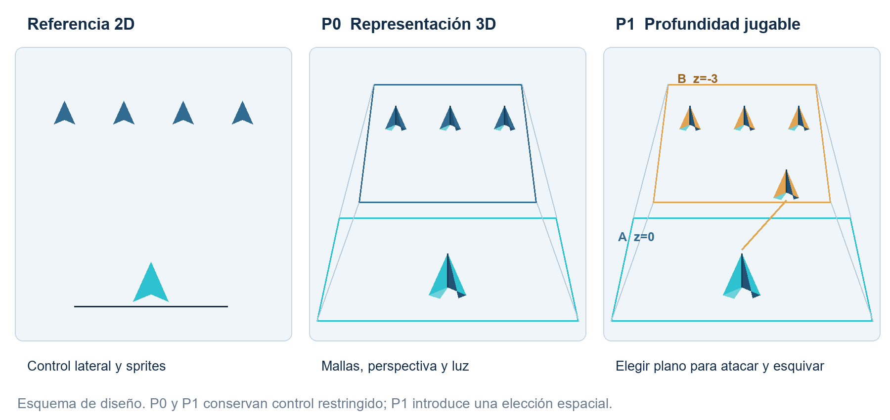
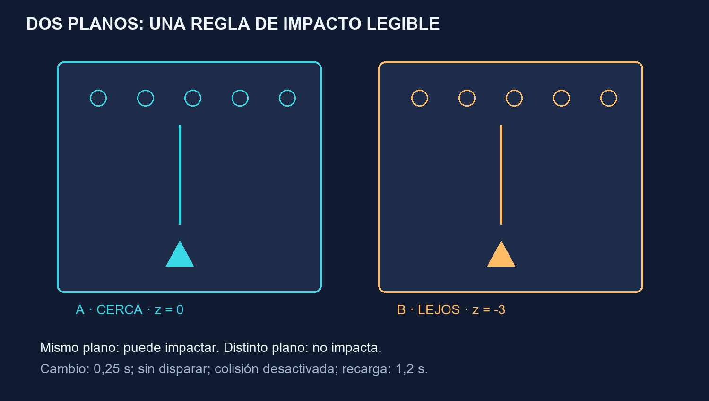

# 🚀 Galaga 3D · VGI

**Del arcade 2D a un juego con volumen y profundidad.**

Proyecto del **grupo 3 de Visualización Gráfica Interactiva**. Este repositorio reúne la propuesta de diseño de Amin, la documentación y las herramientas de organización del equipo.

🎮 **3 oleadas + jefe** · 🧊 **Modelos 3D** · ↔️ **Control lateral** · 🛸 **Dos carriles de profundidad**



> 📌 **Estado:** diseño y materiales de gestión preparados. La implementación e integración del juego en C++/MFC/OpenGL/GLM y sus pruebas están pendientes. La maqueta del navegador permite explicar las reglas.

## ⚡ Empieza aquí

| Lo que necesitas | Abrir |
| --- | --- |
| 📄 Entender la parte de Amin en un minuto | [Resumen de una página](Entrega_Amin_VGI/Resumen_Amin_VGI.pdf) |
| 📊 Organizar tareas, requisitos y pruebas | [Excel integral del equipo](Entrega_Amin_VGI/Gestion_y_diseno/01_Gestion_integral_Galaga3D.xlsx) |
| 📘 Consultar el diseño técnico | [PDF](Entrega_Amin_VGI/Gestion_y_diseno/Diseno_tecnico_Galaga3D_Amin.pdf) · [Word editable](Entrega_Amin_VGI/Gestion_y_diseno/Diseno_tecnico_Galaga3D_Amin.docx) |
| 🧩 Revisar parámetros, estados y oleadas | [Excel de diseño de Amin](Entrega_Amin_VGI/Gestion_y_diseno/03_Diseno_detallado_Amin.xlsx) |
| 🗣️ Preparar la reunión | [Guion](Entrega_Amin_VGI/Guion_reunion.md) · [Trabajo del grupo](Entrega_Amin_VGI/Tareas_para_el_grupo.md) |
| 🖥️ Ver la maqueta y los recursos | Descargar el repositorio y abrir `Entrega_Amin_VGI/INICIO.html` |

## 🎮 La idea del juego

El jugador mueve su nave lateralmente, dispara a las formaciones y esquiva los picados. La partida contiene **tres oleadas y un jefe final**.

1. **P0 · Base jugable:** completar el ciclo de partida en un carril, con modelos volumétricos, iluminación y cámara fija.
2. **P1 · Profundidad:** añadir dos carriles para decidir dónde atacar y esquivar.
3. **P2 · Ampliación opcional:** rescate de una nave aliada y doble disparo, después de verificar P0 y P1.

### 🛸 ¿Qué son los carriles A/B?

**A está delante y B al fondo.** Ambos permiten moverse a izquierda y derecha. Cambiar de carril mueve la nave en profundidad.

| Acción | Control propuesto |
| --- | --- |
| ↔️ Moverse lateralmente | Flechas izquierda/derecha o teclas **A/D** |
| 💥 Disparar | **Espacio** |
| 🔄 Cambiar entre carril A y B | **E** |
| ⏸️ Pausar | **P** |

La tecla **A** sirve para moverse a la izquierda. El **carril A** es el nombre de una posición de profundidad.

**Bala A + enemigo A → impacto. Bala A + enemigo B → sin impacto.**



## 📊 Un Excel para mantener el proyecto

El libro integral conecta **52 requisitos, 60 casos de prueba y 40 tareas**.

| Hoja | Para qué sirve |
| --- | --- |
| 🏠 Inicio | Fechas, semana de consulta, avance, alertas y gráfico de carga. |
| ✅ Tareas | Responsables, apoyos, horas, dependencias, entregables y evidencias. |
| 🎯 Requisitos | Alcance, criterios verificables y aceptación de cada entrega. |
| 🧪 Pruebas | Preparación, pasos, resultado esperado, build y evidencia. |
| 🗓️ Calendario | Vista automática de tareas por semana. |
| 👥 Equipo | Disponibilidad, carga pendiente y sobrecargas. |
| 💬 Acuerdos | Decisiones, riesgos y cambios de criterio. |
| 📖 Guia | Instrucciones de uso y mantenimiento. |

**Rutina de cada reunión:** actualizar fecha y semana → revisar las tareas de cada persona → resolver bloqueos y carga → registrar pruebas y acuerdos.

- 🟨 **Ámbar:** entradas editables.
- 🟦 **Azul claro:** cálculos que se deben conservar.
- 📎 Una tarea `Hecha` necesita **evidencia, revisor y fecha** para contar como aceptada.
- 🧪 Un requisito necesita tarea aceptada, pruebas válidas y aceptación registrada.
- 🔢 Conservar los ids al ordenar o filtrar. Añadir registros dentro de las tablas.
- 🤝 Mantener **una única copia compartida** del Excel.

La planificación propone **209 horas P0/P1 en 13 semanas**, con **8 h por persona y semana** por confirmar. Activar P2 añade 11 horas. Las fechas reales, disponibilidad y alcance se acuerdan con el equipo y el enunciado del curso.

📖 [Guía completa de uso](Entrega_Amin_VGI/Gestion_y_diseno/LEEME.md) · 🔍 [Informe de revisión](Entrega_Amin_VGI/Gestion_y_diseno/Revision_de_la_entrega.md)

## 👥 Equipo y coordinación

| Persona | Área que coordina |
| --- | --- |
| Pablo | 🔎 Estado del arte |
| Amin | 🧠 Diseño de aplicación |
| Ferran | 🖥️ Interfaz |
| Iker | 🛠️ Implementación |
| Uri / Oriol | 🧪 Pruebas |
| David | 📝 Memoria y presentación |

La aportación principal de Amin consiste en concretar **reglas, estados, entidades, rutas, oleadas, colisiones y profundidad**, y preparar sus criterios de verificación. El acta recoge también su apoyo a las otras áreas.

## 🖥️ Abrir los materiales en tu ordenador

1. En GitHub, pulsa **Code → Download ZIP**, o clona el repositorio:

   ```bash
   git clone https://github.com/aminelalam/VGI-Galaga.git
   ```

2. Extrae la carpeta completa si descargaste el ZIP.
3. Abre `Entrega_Amin_VGI/INICIO.html` en tu navegador.
4. Abre los PDF para leer y los archivos Word/Excel para editar.

La portada, diagramas, maqueta y tráiler descargado funcionan localmente. Los enlaces a fuentes externas requieren internet. El HTML se debe abrir desde la copia descargada; en GitHub se muestra su código.

## 📁 Organización

La interfaz editable de Blender, los sprites PNG/SVG, los atlas y sus comprobaciones están en [Recursos_Galaga3D](Recursos_Galaga3D/README.md). Incluye puntos, récord, vidas, oleada, vida del jefe, planos A/B y pausa. La integración con el juego C++ sigue pendiente.

```text
Entrega_Amin_VGI/
├── Resumen_Amin_VGI.pdf              # Tu parte en una página
├── INICIO.html                      # Portada, maqueta y recursos
├── Dossier_Amin_Galaga3D.pdf          # Dossier de consulta
├── Dossier_editable.md               # Versión de texto editable
├── Guion_reunion.md
├── Tareas_para_el_grupo.md
├── CREDITOS.md
├── Gestion_y_diseno/
│   ├── 01_Gestion_integral_Galaga3D.xlsx
│   ├── 03_Diseno_detallado_Amin.xlsx
│   ├── Diseno_tecnico_Galaga3D_Amin.docx
│   ├── Diseno_tecnico_Galaga3D_Amin.pdf
│   ├── LEEME.md
│   ├── Revision_de_la_entrega.md
│   └── figuras/
└── recursos/                        # Acta, imágenes, diagramas y vídeo
```

## 🧭 Próximos pasos

- [ ] Contrastar alcance y criterios con la rúbrica y el anexo completo.
- [ ] Acordar reglas, fechas, disponibilidad y reparto de tareas.
- [ ] Integrar el ciclo P0 en la plantilla de VGI.
- [ ] Incorporar los dos carriles P1 y comprobar su lectura visual.
- [ ] Ejecutar los casos de prueba y guardar evidencias de la build.
- [ ] Evaluar P2 cuando la base y la profundidad estén verificadas.

## 🎨 Fuentes y créditos

El referente es **Galaga**, de Bandai Namco. Los valores concretos de balance y las ampliaciones son propuestas de diseño del proyecto. Las imágenes y el tráiler externos conservan sus atribuciones en [CREDITOS.md](Entrega_Amin_VGI/CREDITOS.md). Las fuentes técnicas se recogen en el Word/PDF.

📋 [Acta original del grupo](Entrega_Amin_VGI/recursos/acta_original.pdf)

---

**🚀 Un diseño que podamos explicar, implementar y comprobar juntos.**
