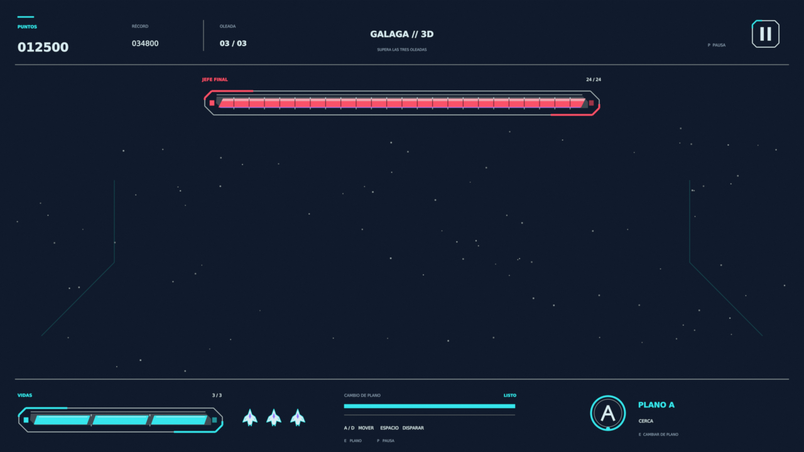

# Interfaz de Galaga 3D

Recursos visuales originales para la interfaz: puntos, récord, oleada, tres vidas, vida del jefe, planos A/B, recarga y pausa. Estilo futurista con cian y colores vivos. Resolución de referencia: **1280 × 720**.



## Abrir y editar en Blender

Abrir [blender/Galaga3D_Interfaz.blend](blender/Galaga3D_Interfaz.blend). Archivo creado y probado con **Blender 5.2.2 LTS**. Hay tres escenas:

| Escena | Uso |
|---|---|
| `01_HUD_TRANSPARENTE` | HUD aislado para superponer al juego; fondo transparente. |
| `02_PREVIEW_INTERFAZ` | Presentación con fondo de estrellas. |
| `03_PANTALLA_PAUSA` | Pantalla de pausa con los indicadores de la partida. |

Las formas son mallas vectoriales y los textos siguen editables. Las colecciones separan puntos, jefe, vidas, planos, controles y paneles. Las fuentes Bitstream Vera están empaquetadas y también incluidas en `fonts/`, con su licencia. Las rutas de render y de fuentes son relativas.

Para cambiar los valores de ejemplo, seleccionar `CONTROL_HUD`, editar sus propiedades personalizadas y ejecutar `ACTUALIZAR_HUD.py` en el editor de textos de Blender con **Alt + P**, colocando el cursor en ese editor. El mismo script se incluye en `scripts/actualizar_hud.py`. El archivo no ejecuta scripts automáticamente al abrirse.

| Propiedad | Valores |
|---|---|
| `puntos`, `record` | 0–999999; seis cifras con ceros iniciales. |
| `oleada` | 1–3. |
| `vidas` | 0–3. |
| `vida_jefe` | 0–24. |
| `mostrar_jefe` | Mostrar u ocultar barra y etiquetas del jefe. |
| `plano_B` | Desactivado: A/círculo/cian/CERCA. Activado: B/rombo/ámbar/LEJOS. |
| `recarga_plano` | Tiempo restante de 0 a 1,2 s; 0 muestra LISTO. |
| `invulnerable` | Indicador de invulnerabilidad. |
| `doble_disparo` | Indicador de la ampliación opcional P2. |

Los valores de la presentación son ejemplos. El jugador conserva tres vidas discretas y el jefe 24 HP; los recursos no cambian las reglas del diseño.

## Recursos para OpenGL

En `hud/` hay **16 sprites PNG RGBA transparentes y sus SVG**, un atlas de iconos de **1024 × 512**, un atlas de las diez cifras de **512 × 64** y 14 etiquetas PNG. Los JSON contienen tamaños, rectángulos y UV. Consultar [HUD y barras](hud/README.md) y [cifras y etiquetas](hud/README_texto.md).

Dibujar fondo, relleno y marco de las barras en ese orden. Recortar el relleno según vidas/3 o HP/24, conservando su ancho original. Dibujar el HUD después de la escena 3D con alpha recto (`GL_SRC_ALPHA`, `GL_ONE_MINUS_SRC_ALPHA`). La documentación de los atlas explica las dos convenciones de origen UV.

`previews/hud_transparente.png` es una composición completa de ejemplo con alpha. Los contadores de esa imagen están fijados: para mostrar valores de la partida hay que usar los componentes y cifras, o dibujar textos desde la aplicación. `previews/interfaz_galaga.png` e `interfaz_pausa.png` son presentaciones con fondo. `previews/verificacion_estado.png` muestra la prueba de 2 vidas, jefe 12/24 y plano B.

**La integración en C++/MFC/OpenGL está pendiente.** El `.blend` y sus scripts permiten editar y comprobar el diseño; no implementan la lógica ni los controles del juego.

## Regenerar y verificar

Ejecutar desde la raíz del repositorio. Python requiere Pillow; Blender debe estar disponible como `blender` o sustituirse por su ruta local.

```sh
python Recursos_Galaga3D/scripts/generar_hud.py
python Recursos_Galaga3D/scripts/generar_texto_hud.py
blender --background --factory-startup --python-exit-code 1 --python Recursos_Galaga3D/scripts/generar_interfaz_blender.py
python Recursos_Galaga3D/scripts/verificar_hud.py
blender --background Recursos_Galaga3D/blender/Galaga3D_Interfaz.blend --python-exit-code 1 --python Recursos_Galaga3D/scripts/verificar_blender.py
```

Los generadores reconstruyen sus recursos; conservar una copia de cualquier edición manual antes de ejecutarlos. Los verificadores no guardan cambios en el `.blend`; generan informes JSON y una imagen de prueba. `validacion_hud_final.json` y `validacion_blender_final.json` recogen la revisión final: archivos, transparencia, atlas, cifras, recortes, valores límite, planos, pausa y portabilidad de las fuentes y rutas.

## Subir a GitHub

Incluir **toda la carpeta `Recursos_Galaga3D/`**, con el `.blend`, `hud/`, `fonts/`, `previews/`, `scripts/`, los informes y este README. El `.blend` ocupa menos de 2 MB. Conservar `fonts/bitstream-vera-license.txt`; la licencia de Bitstream Vera está limitada a las fuentes.

Los gráficos se han generado para este proyecto y no contienen sprites de Namco. Las referencias al juego y al diseño están en la documentación del repositorio.
